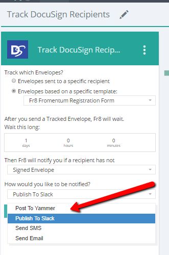

Tagging and Categorization
===========================

We anticipate there will be a lot of different Terminals, Plans and Activities, so we've implemented tools to enable designers to assign categories to their creations.

These categories are used in a couple of ways:
1) when users browse Activities, to help them sort through the available choices
2) by the Hub, when an Activity seeks a list of all of the Activities meeting certain criteria

To apply a Category to an Activity, Plan, or Terminal, add a key value pair [VERIFY THIS] to its Tags property in its JSON definition.

Applying these Category Tags is optional. Doing so may increase the number of views that feature your Activity, Plan or Terminal.

Some Activities specify drop down list boxes and ask the Hub to provide a list filtered on a particular Category. For example, this activity 
has requested that the Hub provide it with a set of all of the Activities that are categorized as Notifier (See Below):

Defined Categories
------------------

### GeneralActivityType
This bins Activities into one of four main types of activity. 

Category |	Description	
--- | ---
Triggers |	Activities that wait for an external event notification to arrive	
Receivers |	Also known as “Getters”. Activities that attempt to load or acquire a piece of data from an external source	
Processors |	Activities that focus on processing and transforming Container data at run-time. They are not forbidden from connecting to external sources, but they’re encouraged to focus on carrying out a single transform of the payload data	
Forwarders |	Activities that push or send data to an external service or another Fr8 Container/Plan

### Notifier

See above. Marks an Activity as being useful for notifying someone of an event. A typical list might include SMS, Email, HipChat, Slack.  An Activity using this Tag should have, as its primary function, a mechanism to notify a user of an event.	
	

### Table Data Generator 
Indicates that an activity generates table data. Used by other activities to query for all activities that generate tables.		

AggressiveReload  [INVESTIGATE. STILL IN USE?]
If present, then each time the client receives a response from a configure call for another action, it will call this activity’s configure action again. Should be used sparingly. In general, well-designed activities do not require this.	

 

[Home](/Docs/Home.md)  
